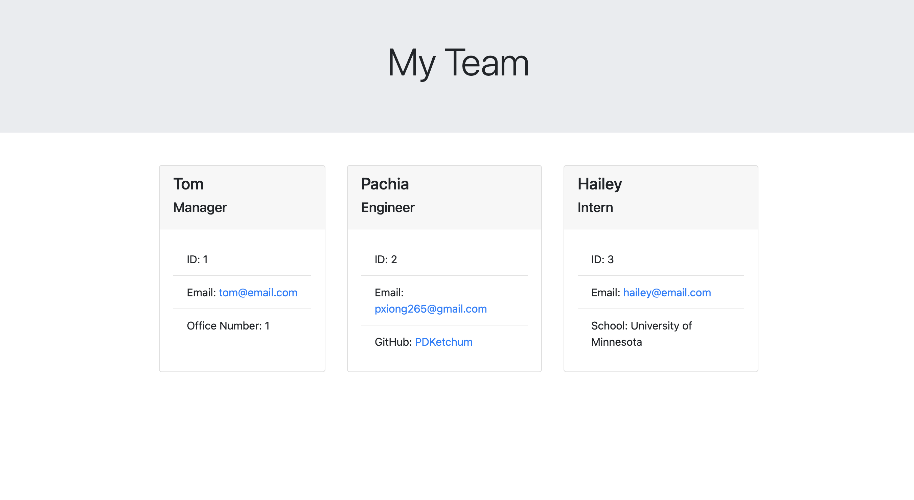

# module-10-team-profile-generator

## Overview

To generate a webpage that displays my team's basic info, I created an application to have quick access to their emails and GitHub profiles
The application takes in user input and inserts it into a template which then generates the index.html file.

## Installation:

1. `git clone git@github.com:PDKetchum/module-10-team-profile-generator.git`
2. Open `index.js`

## How to use:

1. `npm install`
2. `node index.js`
3. Input team information

GitHub URL: https://github.com/PDKetchum/module-10-team-profile-generator

_Screenshot of page_
